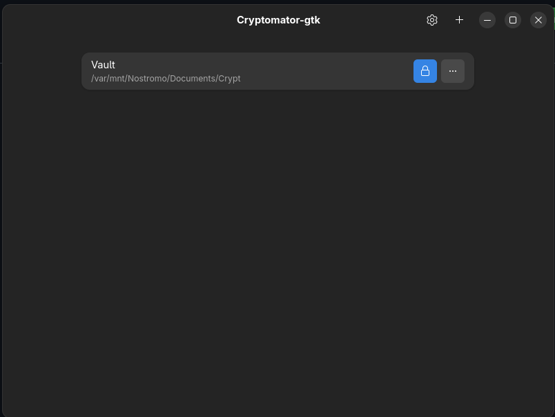

#  Locker

A lightweight GTK4/Libadwaita desktop application for managing Cryptomator vaults on Linux.

## Features

- 🔓 **Unlock and lock Cryptomator vaults** - Full vault management without the official Java app
- 🆕 **Create new vaults** - Fully standalone vault creation (no official Cryptomator app needed!)
- 🔐 **Secure password handling** - Optional system keyring integration
- 📁 **File manager integration** - Automatically opens mounted vaults
- ✏️ **Rename vaults** - Organize your vaults easily
- 🗑️ **Remove vaults** - Clean up your vault list

## Screenshots



## Installation

### From Flatpak Bundle (Recommended)

Download the latest `.flatpak` file from the [Releases](../../releases) page and install:

```bash
flatpak install locker-v0.1.6.flatpak
```

### From Source

Requirements:

- Flatpak
- flatpak-builder
- GNOME SDK 47

Build and install:

```bash
flatpak-builder --force-clean --install --user build-dir io.github.ljam96.cryptomatorgtk.yml
```

## Usage

### Adding Existing Vaults

1. Click the **Add Vault** button
2. Navigate to your vault directory
3. Select the vault folder
4. Enter your password when unlocking

### Creating New Vaults

1. Click the menu button (⋮) next to **Add Vault**
2. Select **Create New Vault**
3. Enter vault name, location, and password
4. Click **Create**
5. The vault is ready to use immediately!

### Managing Vaults

- **Unlock**: Click the lock button or double-click the vault row
- **Lock**: Click the unlock button or double-click while unlocked
- **Rename**: Click the menu (⋮) → Rename
- **Remove**: Click the menu (⋮) → Remove (vault files are not deleted)
- **Open in File Manager**: Click the folder icon when vault is unlocked

## Technical Details

### Vault Creation

Cryptomator-gtk creates fully compatible Cryptomator format 8 vaults:

- **Key Derivation**: scrypt (N=32768, r=8, p=1) with random salt
- **Encryption**: AES-256 with SIV mode (RFC 5297) for directory IDs
- **Authentication**: JWT (HS256) for vault configuration
- **Key Wrapping**: RFC 3394 AES Key Wrap for master keys

The encrypted root directory structure is created using proper AES-SIV encryption via the [miscreant](https://github.com/miscreant/miscreant.py) library, ensuring full compatibility with official Cryptomator.

### Dependencies

- Python 3.12
- GTK4 / Libadwaita
- cryptomator-cli (bundled)
- cryptography 46.0.3
- PyJWT 2.10.1
- miscreant 0.3.0

### Backend

Uses `cryptomator-cli` for vault operations via FUSE mounting. The CLI is bundled in the Flatpak and requires no separate installation.

## Development

### Project Structure

```
locker/
├── src/
│   ├── main.py              # Application entry point
│   ├── window.py            # Main window
│   ├── row.py               # Vault row widget
│   ├── vault.py             # Vault data model
│   ├── backend.py           # Cryptomator CLI wrapper
│   ├── vault_creator.py     # Vault creation logic
│   ├── create_vault_dialog.py  # Creation UI
│   ├── password_dialog.py   # Password input dialog
│   └── settings_dialog.py   # Settings
├── data/
│   ├── io.github.ljam96.locker.desktop
│   └── io.github.ljam96.locker.svg
├── io.github.ljam96.locker.yml  # Flatpak manifest
└── .github/
    └── workflows/
        └── release.yml      # Automated builds
```

### Building Locally

```bash
# Install dependencies
flatpak install org.gnome.Platform//47 org.gnome.Sdk//47

# Build and install
flatpak-builder --force-clean --install --user build-dir io.github.ljam96.cryptomatorgtk.yml

# Run
flatpak run io.github.ljam96.cryptomatorgtk
```

### Running in Development Mode

```bash
# Run with debug output
flatpak run io.github.ljam96.CryptomatorGTK 2>&1 | tee debug.log
```

## Releasing

To create a new release:

1. Update version in code if applicable
2. Commit all changes
3. Create and push a version tag:

```bash
git tag v0.1.5
git push origin v0.1.5
```

The GitHub Action will automatically:

- Build the Flatpak
- Create a bundle file
- Generate SHA256 checksum
- Create a GitHub release with artifacts

## Known Limitations

- **FUSE required**: Vault mounting requires FUSE support
- **Flatpak sandbox**: Some filesystem locations may require additional permissions
- **No password change**: Password changing not yet implemented (use official Cryptomator app)

## Troubleshooting

### Vault won't unlock

- Verify password is correct
- Check that FUSE is available: `modprobe fuse`
- Ensure mount point is accessible

### Created vault won't open in official Cryptomator

Vaults created with Cryptomator-gtk are fully compatible. If there's an issue:

- Verify all files exist: `masterkey.cryptomator`, `vault.cryptomator`, `d/` directory
- Check permissions on vault directory

### Flatpak won't install

```bash
# Check Flatpak version (1.12+ required)
flatpak --version

# Update Flatpak
sudo apt install flatpak  # Debian/Ubuntu
sudo dnf install flatpak  # Fedora
```

## Contributing

Contributions welcome! Please:

1. Fork the repository
2. Create a feature branch
3. Make your changes
4. Test thoroughly
5. Submit a pull request

## License

[GPL-3.0 License](LICENSE)

This project is licensed under GPL-3.0 to maintain compatibility with bundled components. See LICENSE file for full details.

## Credits

- Built with GTK4 and Libadwaita
- Uses [cryptomator-cli](https://github.com/cryptomator/cli) (AGPL-3.0) for vault operations
- Implements [Cryptomator vault format](https://docs.cryptomator.org/en/latest/security/architecture/) specification
- AES-SIV implementation via [miscreant](https://github.com/miscreant/miscreant.py)

## Related Projects

- [Cryptomator](https://cryptomator.org/) - Official cross-platform application (GPL-3.0)
- [cryptomator-cli](https://github.com/cryptomator/cli) - Command-line interface (AGPL-3.0)

## Disclaimer

This is an independent community project and is not affiliated with, endorsed by, or sponsored by Skymatic GmbH or Cryptomator.org.

**Cryptomator** is a registered trademark of Skymatic GmbH. This project uses the Cryptomator name to indicate compatibility with the Cryptomator vault format and to acknowledge the use of cryptomator-cli as a dependency. No trademark infringement is intended.
